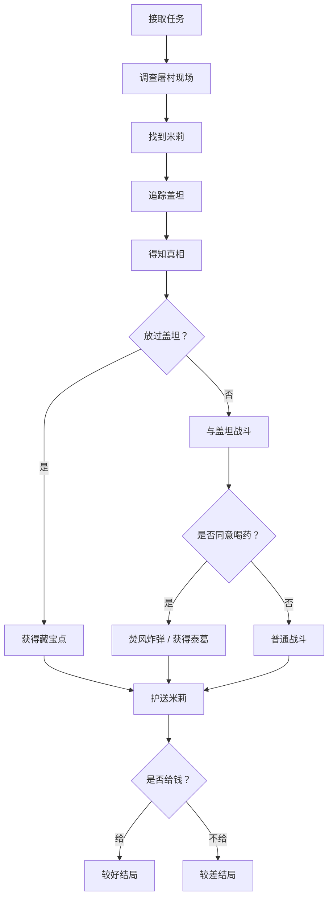

# 《巫师3：狂猎》支线任务拆解案  
## 《彼处山猫与狼共舞》：经典支线任务分析

## 一、拆解对象

本文拆解对象为《巫师3：狂猎》DLC 支线任务 **《彼处山猫与狼共舞》**。任务从威伦奥瑞登的告示板接取，表面上源自“霍洛顿有怪物作祟”的普通委托，但玩家抵达霍洛顿后，发现整座村庄已经被屠戮，真正的“凶手”不是怪物，也不是强盗，而是一名猫学派猎魔人盖坦。

任务体量是经典的支线任务体量，不算大，但是融合了《巫师三》支线任务系统的几大特色，包括**开放世界式任务接取、环境叙事、调查追踪、对话以及道德两难选择、选择带来的后续影响**

---

## 二、任务流程还原

该支线任务的开头与多数游戏中的猎魔委托任务类似，玩家在告示板上接取任务“霍洛顿的野兽”。
按照玩家惯性逻辑，任务应该是标准的猎魔委托流程：到村子、与npc对话接取委托、调查追踪、杀掉怪物、领取赏金。

但玩家来到霍洛顿后发现了村里惨遭屠杀，没有活人npc，玩家操控杰洛特先清理现场的食尸鬼后通过猎魔感官检查尸体和痕迹，发现了以及被砍下的鹿首精头颅，在村子的马厩里，还发现了一把带着血迹的草叉。
这时会触发杰洛特的台词：“这种武器在近身战的时候非常危险。”（在《猎魔人》原著中，杰洛特就是被草叉刺穿身体而死）最后确认：
1. 村里原本确实有怪物委托  
2. 另一名杀手解决了委托
3. 村民们并不是被怪物杀害，而是被利刃杀害，说明凶手精通剑术

随后，玩家会遇到一个幸存的小女孩，再见到杰洛特后小女孩躲了起来，而杰洛特通过追踪脚印发现了小女孩并与其对话。

在与名叫米莉的小女孩对话后我们会得知：有一个长着和杰洛特一样猫眼的人来到村子（另一个猎魔人），与村长交谈（商讨猎魔委托）后进入了树林，带着鹿首精的头颅回来了。但而后他却和村长发生了争吵（具体原因未知），一众人去了马厩并发生了冲突（草叉为后文埋下伏笔），米莉是唯一一个活下来的人。

并且米莉还会给杰洛特一枚猫学派的猎魔人徽章，表示是那个猎魔人留下来的。

完成对话后，我们可以追踪猫学派猎魔人留下的血迹找到他的藏身之处，由于他在与村民争执期间受了伤，因此并没有走远。

找到猫派猎魔人盖坦后，我们从他口中得知了事情的始末：盖坦在完成猎魔委托后，将鹿首精战利品拿回村子结算报酬，但村长却与之前谈好的不同，在价钱上变了嘴脸。只愿意给盖坦12克朗。连买药的材料钱都不够。（游戏中杰洛特接到的两个鹿首精委托：森林之心和森林之王，报酬分别是60克朗与约300克朗）

而在盖坦表示不能接受后，村民们带着笑脸欺骗他马厩中有金子，却不想在进入马厩后被身后的村民拿起草叉偷袭，盖坦凭借敏捷躲开了致命伤，并情绪失控，将怒火发泄在全村村民身上，屠杀了整个村子。

当杰洛特问起为什么放过小女孩时，盖坦回答：“她很像我妹妹，印象里的妹妹…我被带去猫学派时，她就是这个年纪。” “她十年前就死了，老死的。”这从侧面印证了这个猫派猎魔人的情感与正常人一致，是有着七情六欲的，有愤怒也有怜悯。

之后任务进入分支：
- 如果玩家愿意放过他，则盖坦会给出藏宝点作为谢礼，触发任务“想拿就拿吧”
- 如果玩家认为“村里死了太多无辜的人”，可以继续选择与盖坦开战，但无法触发任务“想拿就拿吧”，但后续仍可以自己探索去到猎魔人的秘密仓库

若开战，盖坦会提出自己有伤，需要先喝药才能“公平决斗”，任务会进入另一个小分支
- 如果同意盖坦喝药，他会趁杰洛特不备投出“焚风”炸弹，产生致盲效果，战斗难度会加大，但战斗结束后可以获得一把特殊的钢剑**泰葛**
- 如果不同意盖坦喝药，战斗结束后只会掉落普通银剑

该分支结束后，玩家还需要把米莉送去奥瑞登找亲人；如果此时离开任务区域，米莉支线会直接失败（猜测小女孩是被狼群袭击死亡）。
在将米莉送到亲人家中后，米莉阿姨会表示家中日子不好过，会触发与米莉阿姨的对话分支：
- 玩家可以选择给钱接济米莉阿姨
- 玩家也可以选择不给钱

这里给钱与否会进一步影响后续米莉阿姨对米莉的态度，进而影响人物的后续发展结局
- 如果选择了给钱，后面再次回到奥瑞登后会触发动画，米莉会送给杰洛特一幅画，可以放在杰洛特在陶森特的家中
- 如果选择了不给钱，再返回后米莉会消失，猜测是饿死了
- 如果选择了给钱，但过了很长时间后再次回到奥瑞登，会发现米莉消失，阿姨还醉醺醺的，符合猎魔人暗黑的世界观，钱花完了，米莉最终还是死了

至此该任务结束。

---

## 三、该任务想解决什么设计问题

如果从系统策划角度反推，我认为这条任务至少在解决三个问题。

### 1. 打破常规支线任务的模板套路，避免让玩家有“通马桶”的重复体验

《巫师3》有大量委托型任务，玩家很容易形成固定预期：看告示、找村长、听故事、杀怪、领赏。而《彼处山猫与狼共舞》故意利用了这种惯性预期，先通过常规猎魔任务开头，再到后面揭示任务不同，再到最后逼迫玩家再次做道德两难的选择。

该任务设计巧妙利用了“任务模板化"与实际故事之间的落差，为玩家营造了一种**惊喜**的感觉 - 玩家在游玩到发现这不是单纯的猎魔委托后，不会有做常规支线任务的疲劳感，而是会感觉游戏的叙事方式非常精妙。

另外该任务有丰富的后续任务结构构成

### 2. 丰富世界观和人物形象

游戏中花了很多篇幅描述猎魔人和人类之间的矛盾与冲突，这一点在我们扮演杰洛特的时候会感受到。而这个任务可以说是这个核心世界观的实际诠释之一。这种让玩家亲身体验的任务极大程度地丰富了世界观。

剧情靠逼迫玩家进行道德选择，一方面让玩家的代入感增强，另一方面也能塑造杰洛特在不同玩家操作下的不同形象。

### 3. 怎么让道德选择变得困难

这个话题贯穿了整个巫师三的支线任务系统，核心问题在于不去主观塑造对错，而是摆出一个在道德败坏世界中两派势力的矛盾点，再去让玩家做选择。但选择一定是有取舍的、有道德困境的选择。

譬如说在这个任务中，如果我们选择放过了猎魔人盖坦，就无法为那些无辜死去的村民鸣不平；但反过来讲，我们对猎魔人遭遇的同情也会让我们很难去杀掉他。

---

## 四、任务结构拆解

### 1. 任务入口模块

正如刚才所说，这个任务的开头与游戏中很多的其他猎魔委托任务别无二致，而这一点玩家预期与实际情况的偏差营造了一种惊喜感，也减轻了支线任务的重复度。

从系统设计上看，这种设置节省了教学成本，因为玩家知道该怎么进入任务；同时又制造了反差，因为抵达后的场景与模板预期完全不同。

---

### 2. 环境模块

抵达霍洛顿后，这个任务在第一时间并没有用文本和说明或任何对话给玩家关于其的信息，而是先是用环境细节来传递信息：

- 遍地尸体
- 食尸鬼啃食
- 屋内残迹
- 鹿首精首级
- 带血的草叉

这些信息先是为故事情节提供了一个第一印象，并且为后面故事情节的揭晓埋下了伏笔。

如此的叙事方法提供了几个好处：

- 第一，增强了代入感，让玩家有自己调查的体验
- 第二，增强了真实感，使情节过渡更平滑，不显突兀
- 第三，环境实际上可以说扮演了一个承上启下的平台作用，从一开始玩家对这个任务的印象可能是“一个重复的支线任务”，到这里揭示任务另有隐情。所以环境本身就是叙事主体。

---

### 3. 机制模块

这里主要的机制就是调查机制和战斗机制，战斗并不是该任务独有的，所以在这里也不再赘述了。

关于“调查”机制，其实在这里更像是一种类QTE形式的，玩家按照设计的流程走的调查，也就是说调查玩法程度并不算深。

玩家全程在做的，就是在设定的范围内，使用猎魔感官能力去一个个互动泛着红光的线索，再触发杰洛特的台词。

从系统策划角度说，这一套机制很简单，但不能说不有效，因为：

- 制作起来简单，复杂度低
- 游玩起来简单，玩家不用做解密抉择、或者去查攻略等
- 节奏可控，按照设计师的布局一步步来，叙事节奏合理平滑
- 与游戏的调性统一一致，《巫师三》并不是一款重解密的游戏，所以这样处理可以说算是比较自然，不突兀

它的缺点也很明显：  

- 玩家自由度低
- 代入和真实感还有提升空间

---

### 4. NPC模块

先说小女孩米莉，这个角色很关键，她的作用主要有以下几点：

- 激发玩家的同情心理，父母家长全部被杀，剩下自己一人，如果玩家后来选择杀死盖坦，他们的动机大概率是从这里来
- 承上启下，将玩家对环境的发现从一个NPC口中自然地叙述出来，然后又很自然地过渡到下一个部分，也就是驱动杰洛特去寻找盖坦
- 通过思考为什么她没有被猎魔人杀死，为后面猎魔人盖坦人性尚存的情节埋下铺垫
- 尾声中她的后续结局发展是这个任务在整个世界观中的后续体现

为了让玩家的道德两难选择显得更沉重，更难抉择，游戏必须提供玩家两个截然相反，但足够强烈的动机去驱使玩家放过/杀死盖坦。

而这两个动机基本都是在米莉身上呈现的：猎魔人该死，因为他杀死了全村无辜的人，让一个孩子家破人亡；猎魔人不该死，因为他放过这个孩子说明了他并不是毫无人性的恶魔。

猎魔人盖坦，他承担了在这个任务中人类与猎魔人矛盾的主要体现，并且是我们道德抉择的后果体现。这个逻辑很简单，如果玩家觉得他该死，那么就会展开战斗他就会死，如果我们放过他，他就不会死。

但主要的矛盾点在于，如果他是个没有任何作用的NPC，玩家对他的死不会有任何感觉。而为了避免这一点，设计通过了侧面描述和亲历描述，描述了盖坦的难处，也给了玩家杀死/放过他的理由。

从这个层面上讲，小女孩米莉虽然不是事件的中心人物，但反而在任务中承担了更多的内容。

---

### 5. 分支模块

这个任务的分支系统不算该作中最复杂的支线任务，但他依然行之有效，原因是以下几点：
- 第一，不同选择之间价值观差异大，所以玩家才会觉得选择难做
- 第二，不同分支引导了不同后续结果，不管是玩家获取装备的不同，或者是任务后续对世界观的体现，都足够充分
- 第三，不同分支都给玩家提供了足够的动机去选择，所以才是真正的分支

总而言之，分支可以不多，但需要提供足够的前置动机去驱使不同玩家走不同分支路线，并且不同分支的后续影响要足够差异化。

---

## 五、这条任务的局限以及改动建议

### 1. 调查模块的自由度较低
玩家主要是按照系统安排的顺序逐步与线索交互，而后通过NPC的口中获取事件真相。

### 2. 分支的可能性还可以更丰富一点
故事的分支虽说已经够用，但是如果更加丰富会大大增加玩家的代入感。

### 改动建议
参考《巫师三》中另一个著名的支线任务《肉体之罪》中结局的处理，当玩家找到一个犯罪嫌疑人时，会出现两个限时选择：杀掉或审问；如果杀掉则会错过真正凶手，但这反而是设计的精妙之处。因为《巫师三》这款游戏本身就是多选择多分支的游戏，更多的分支反而会提供更多的重玩价值。
我认为这个任务可以参考这个类似的思路，提供更多分支或后续对世界观的影响，比如说：
1. 当玩家与米莉交谈过后，可以选择“我不相信你，猎魔人是不会滥杀无辜的。”之类的选项，如此结局将会导致坏结局
2. 在玩家杀掉盖坦后，会在他身上发现一封神秘书信，里面透露了一名术士调制的药水才是导致盖坦性情大变的元凶
3. 如果玩家没有在告示板上看到委托便直接来到这个村子，会触发村民与猎魔人盖坦正在争吵的场景，并提供几个全新分支，比如使用亚克席法印说服村民给盖坦约定的赏金等等，达成隐藏结局
4. 在玩家调查完所有线索后，提供数个案件猜测结论选项，比如：
   1. 这肯定是刚才那只我杀掉的食尸鬼干的，
   2. 这肯定是一个剑术精湛的杀手干的，
   3. 这肯定是尼弗迦德的士兵干的，
   4. 这可能是上天降下的惩罚

   等等此类选项，只有玩家选择正确任务才能推进，这类选项虽然有的与事实大相径庭，但大大增强了玩家在调查过程中的参与感。

---

## 六、结论

《彼处山猫与狼共舞》不是《巫师3》里最长最丰富的支线任务，却是一条结构非常工整的任务。

各种模块之间的配合精妙，并且回归了游戏的核心世界观和特色，从任务策划的角度看，这条任务的节奏把控的很好，并且各个模块都放在了最合适的位置上。

这种拆解提供了一个清晰的，可以被分析甚至复用的任务结构。
