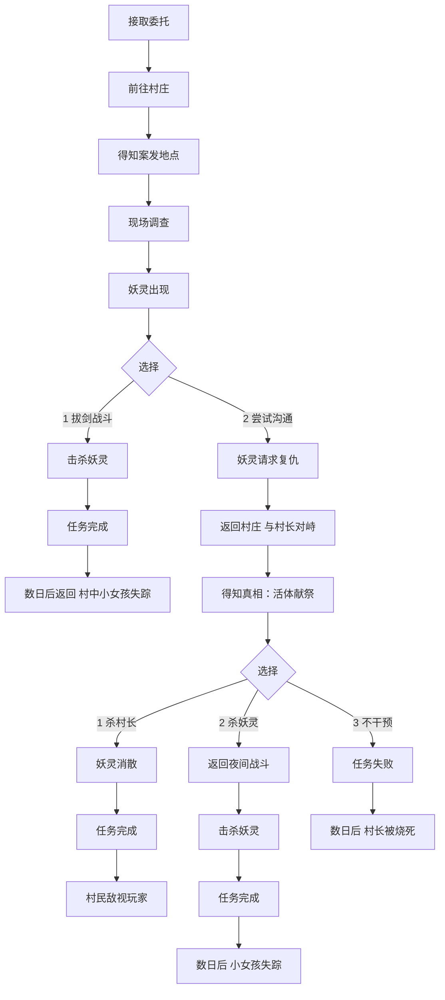

# 巫师三自创任务设计案 - 《谎言村》
## 关卡策划练习

## 基础信息
- **关卡名称**：谎言村 （Village of Liars）
- **关卡类型**：重叙事型调查类支线任务
- **所属区域**：威伦
- **推荐等级**：较低，因为威伦属于游戏前期区域
- **参与角色**：杰洛特
- **预计时长**：30分钟左右
- **任务触发方式**：接取委托或者路过任务区域即可触发

- **任务核心标签**：
    · 道德困境
    · 多分支，网状叙事
    · 推理和调查

## 任务流程

玩家在告示板接取委托《帮帮我们！》，委托内容为一名小女孩留下的信息：

我爸爸在晚上出门打猎的时候被烧死了，但附近没有火。村里已经不止一个人这样死了。最近晚上村子外面总是阴森森的。妈妈不让我说这些，如果你能帮助我们，请快来看看！

随后玩家操控杰洛特来到村中，与小女孩对话后得知其父亲死亡的具体细节，但小女孩的母亲介入并不愿告知更多细节，在杰洛特逼问后最终告知案发地点。

杰洛特到达案发地点后检测出魔法残留，并推断是夜间妖灵所做。P.S.夜间妖灵的起源是由于生前在愤怒与痛苦中死去，强大的怨念幻化而成。

于是杰洛特在原地等候到晚上，夜间妖灵现身，此处弹出两个限时选项：1. 拔剑战斗，2. 等等，我只想谈谈

· 如果玩家选择1，则杀死妖灵后任务完成，但真相依旧不清楚，而在玩家等候数日后回到这个村子，会发现那名写下委托的小女孩失踪，母亲在家中独自哭泣。

· 如果玩家选择2，妖灵会告诉杰洛特：“帮我复仇，我便会离开。”然后妖灵消失。

如果玩家选择了2，玩家可以操控杰洛特回到村子内后与村长交涉，可以使用武力威胁或亚克席法印逼问出事件的真相：原来是村子有活体献祭年轻女性的传统，而主持仪式的就是村长本人，他坚持要活活烧死上一个年轻女性，所以对方幻化成妖灵回到村中杀了那些参与仪式的人。

得知真相后，出现三个分支选项：1. 杀掉村长， 2. 回去杀掉妖灵， 3. 这不关我的事

· 如果选择1，则任务结束，妖灵不会再出现，但当杰洛特回到村子会遭到村民的辱骂。

· 如果选择2，则达成与刚才杀死妖灵同样的结局：任务完成，在玩家等候数日后回到这个村子，会发现那名写下委托的小女孩失踪，母亲在家中独自哭泣。

· 如果选择3，任务失败，等候数日后玩家回到村中发现村长以同样的死法惨死家中。

至此，任务结束。以下是任务的主要分支图：

## 设计目标

- 在初始构建信息不对等的情况下，逼迫玩家做出限时选择：杀掉或不杀妖灵，加强了玩家在解密过程中的参与感。玩家并不需要盲目接受游戏给出的剧情，而是自己去发掘。
- 给予了玩家充分的自由选择空间，玩家可以选择帮助妖灵/帮助村民/坐视不管，但每个选择都要求玩家必须承担相对应的代价，符合《巫师三》游戏调性。
- 各个分支达成的结局足够有差异化，所以玩家做选择时才不会觉得无所谓，因此这套系统才有效。

